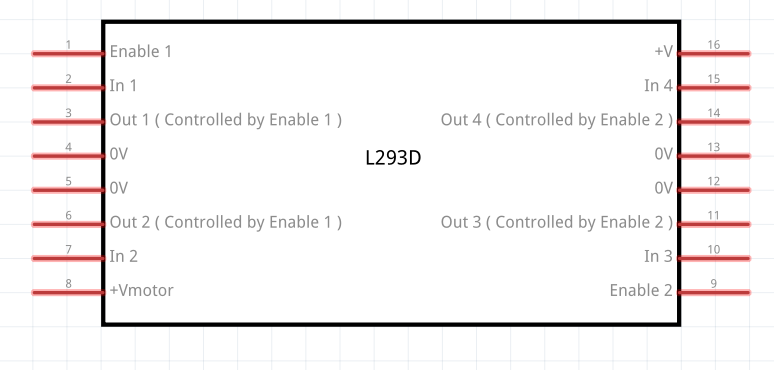
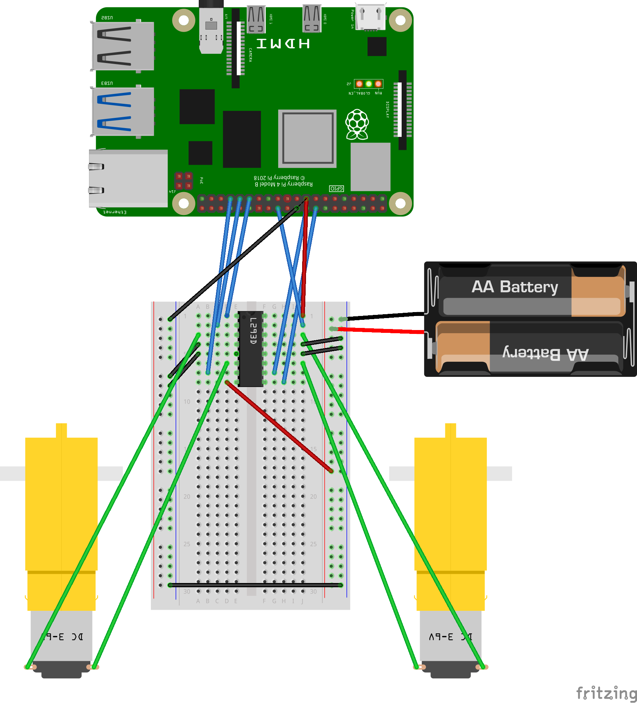
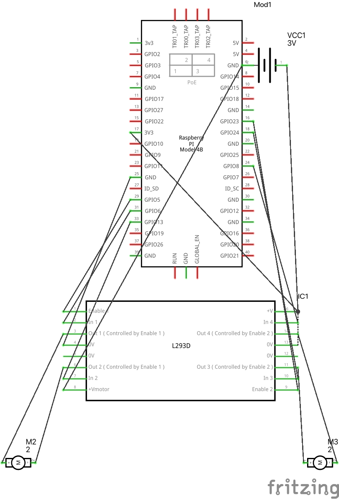

## Breadboard design

This document describes the breadboad connections design which setup our automatic vehicle. The main components of the setup are the raspberry pi (the brain), motor (the wheels), the motor controller - an encoder which converts the raspberry pi input into the output signals for the motor, and finally, a baterries pack which power on the motor controller and consequently the motors.

## Energy

Note that the batteries are connected to the motor controller which expects 5V. Since we have 4 batteries of 1.5V connected in paralel, the resulting energy from them is 4 \* 1.5V = 6V, which is enough to power our motor controller and hence, our motors.

For raspberry pi powering, we will be using the computer USB plug. Later on in the tutorial we will cover the step-by-step of connections on how to power the raspberry pi so that it becames portable as well.

## L293D Motor Controller

The motor controller main function is to encode the raspberry pi controller GPIO signals into the signals understandable by the motors. This motor controller was designed to control two motors, hence it is symetric in its way. Some of the main components are:

1. Enable/Disable PIN (times 2 for two motors)
2. Two input pins to receive data from raspberry pi (x2)
3. Two output pins to send data received from input pins, to the motor. (x2)
4. The 0V - ground pins which direct excess of energy into the ground. (x2)
5. +Vmotor/V+ - the power pins which receive voltage and forward it.

The goal of the motor controller is to receive the energy from +Vmotor/V+ and to receive the input commands from Enable/Input pins. Once the energy flow is above 5V, and the input is setup in a way to make the motor move, the output pins then send the signals to the motors and make them move. The excess of energy will flow out view ground 0V pins.

Obviously that once the motor wheels are moving, once connected to the actual wheel, it will make the vehicle move.

Follows the schematics representation of the L293D Motor Controller.

## Final Connection View on the breadboard

Final view of the connections of the breadboard are as follows:

1. The Motor Controller connects to both Motors and to rapsberry pi. It receives the signals GPIO from raspberry pi, encodes them and sends them to the motors
2. The energy originates from baterries. Therefore, the +Vmotor pin is directly connected with the battery. These baterries are not powering raspberry pi, but only the motor controller and the motors.
3. The grounds connect to the batteries, and two the raspberrypi.

## Final View - schematics

For completeness, follow the schematics of the connections:

.

## Conclusion

All this is good, but nothing will work unless we have software deployed onto raspberry pi. Once the physical connections are established, head on to [this readme to setup the software](../README.md) according to your expected setup
