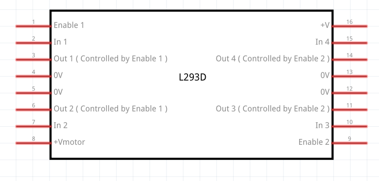
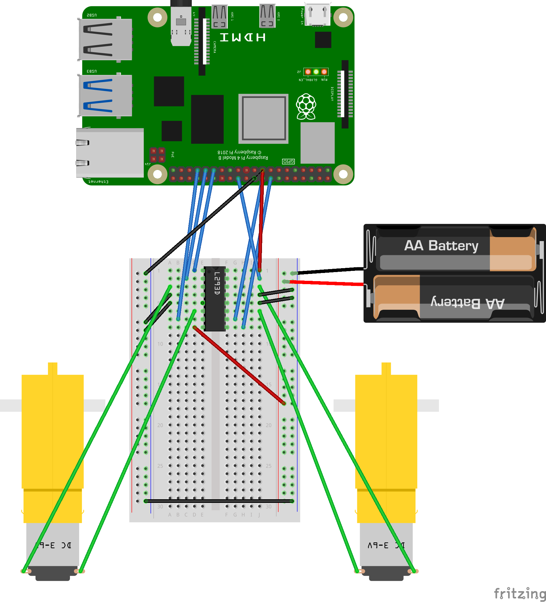
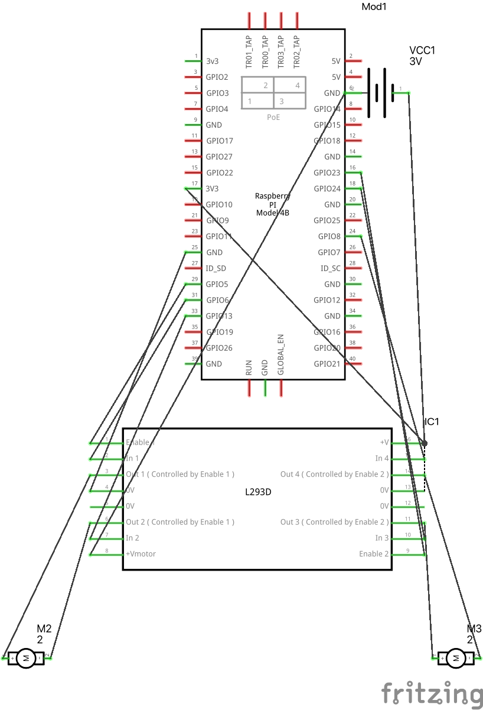
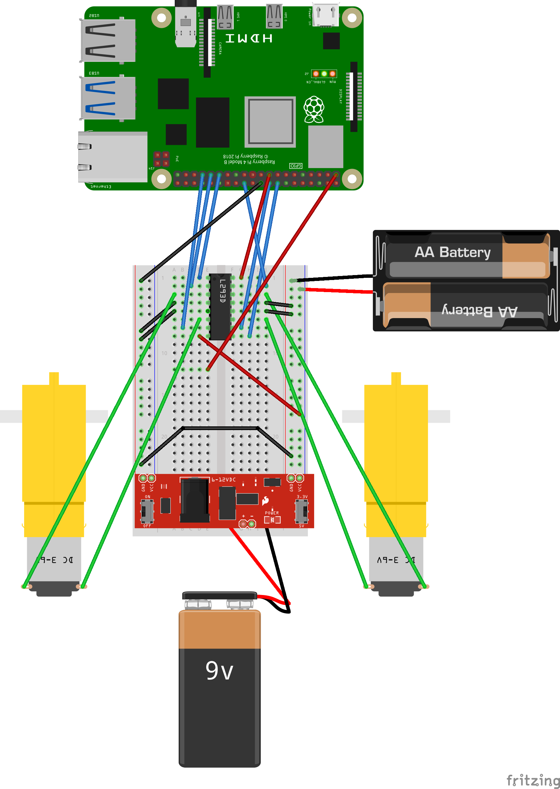

## Breadboard design

This document describes the breadboad connections design which setup our automatic vehicle. The main components of the setup are the raspberry pi (the brain), motor (the wheels), the motor driver - an encoder which converts the raspberry pi input into the output signals for the motor, and finally, a baterries pack which power on the motor driver and consequently the motors.

## L293D Motor driver

The motor driver main function is to encode the raspberry pi driver GPIO signals into the signals understandable by the motors. This motor driver was designed to control two motors, hence it is symetric in its way. Some of the main components are:

1. Enable/Disable PIN (times 2 for two motors)
2. Two input pins to receive data from raspberry pi (x2)
3. Two output pins to send data received from input pins, to the motor. (x2)
4. The 0V - ground pins which direct excess of energy into the ground. (x2)
5. +Vmotor/V+ - the power pins which receive voltage and forward it.

The goal of the motor driver is to receive the energy from +Vmotor/V+ and to receive the input commands from Enable/Input pins. Once the energy flow is above 5V, and the input is setup in a way to make the motor move, the output pins then send the signals to the motors and make them move. The excess of energy will flow out view ground 0V pins.

Obviously that once the motor wheels are moving, once connected to the actual wheel, it will make the vehicle move.

Follows the schematics representation of the L293D Motor driver.

## Breadboard - from RPI to Motors

Final view of the connections of the breadboard are as follows:

1. The Motor driver connects to both Motors and to rapsberry pi. It receives the signals GPIO from raspberry pi, encodes them and sends them to the motors
2. The energy originates from baterries. Therefore, the +Vmotor pin is directly connected with the battery. These baterries are not powering raspberry pi, but only the motor driver and the motors.
3. The energy is also connected to the raspberry pi and from it, to the V+ of the motor driver
4. The grounds connect to the batteries, and two the raspberrypi.

## Circuit Shematics - from RPI to Motors

For completeness, follow the schematics of the connections:

.

## Energy

The batteries are connected to the motor driver which expects 5V. Since we have 4 batteries of 1.5V connected in paralel, the resulting energy from them is 4 \* 1.5V = 6V, which is enough to power our motor driver and hence, our motors.

For raspberry pi powering, we will be using the computer USB plug. Later on in the tutorial we will cover the step-by-step of connections on how to power the raspberry pi so that it becames portable as well.

Note it's common to see a connection from the Raspberry Pi Pico's 3V3 pin to the V+ of the motor driver. This connection might seem redundant since both the Raspberry Pi Pico and the motor driver have their own power sources, but it serves an important purpose. Here are a few reasons for this connection:

- Voltage Reference: The most common reason for connecting the 3V3 pin from the Raspberry Pi to the motor driver is to establish a common voltage reference or ground. This ensures that the signal levels between the Raspberry Pi and the motor driver are compatible and stable. Without a common reference, the GPIO signals from the Raspberry Pi might not be interpreted correctly by the motor driver.

- Logic Level Compatibility: The L293D motor driver operates based on the logic level of the input signals it receives. By connecting the 3V3 pin from the Raspberry Pi to the motor driver, you ensure that the logic levels are compatible, especially if the motor driver is designed to work with 3.3V logic levels, which is the output level of the Raspberry Pi Pico.

- Power for Internal Logic Circuitry: Sometimes, the motor driver might require a lower voltage (like 3.3V) for its internal logic circuitry, even if the main power for driving the motors comes from an external battery. The 3V3 connection from the Raspberry Pi could be providing this necessary power.

### Adding 9V to Raspberry Pi

Finally, to make our RPI portable and disconnect it from fixed USB cable, we need to provide it an energy source. For that means, we are going to do as simple, as adding the 9V battery source. Note, that raspberry pi should not be supplied the 9V directly, as this will damage it. Instead we should use 9V battery with the voltage regulator or a DC-DC converter to step down the voltage to the safe level of 5V. This stepped-down voltage can then be supplied to the Raspberry Pi through the GPIO pins.

We are going to be using the breadboard power supply for that purpose. Essentially, the breadboardpower supply achieves the above: converts the 6V-12V into 5V and it contains pins to connect directly to the breadboard.

Follows the updated breadboard image:

.

Note that we are using breadboard power supply which is a plugin to connect the 9V battery to RPI via breadboard. You may use any mean you prefer to connect the source to the raspberry pi.

## Conclusion

All this is good, but nothing will work unless we have software deployed onto raspberry pi. Once the physical connections are established, head on to [this readme to setup the software](../README.md) according to your expected setup
